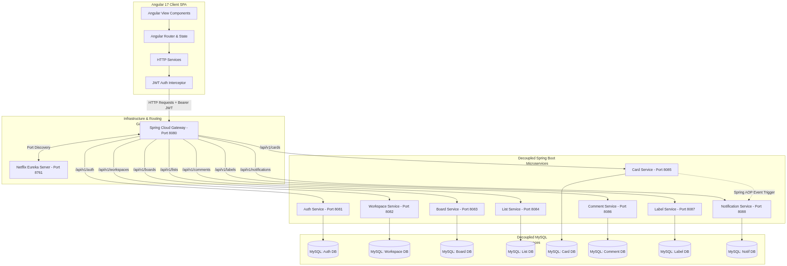
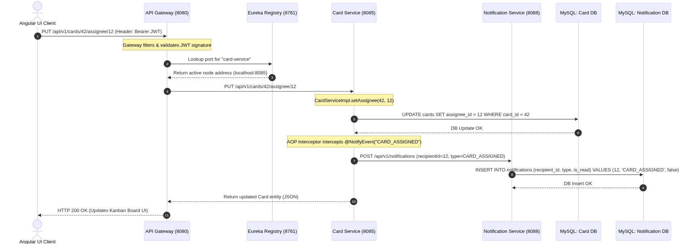
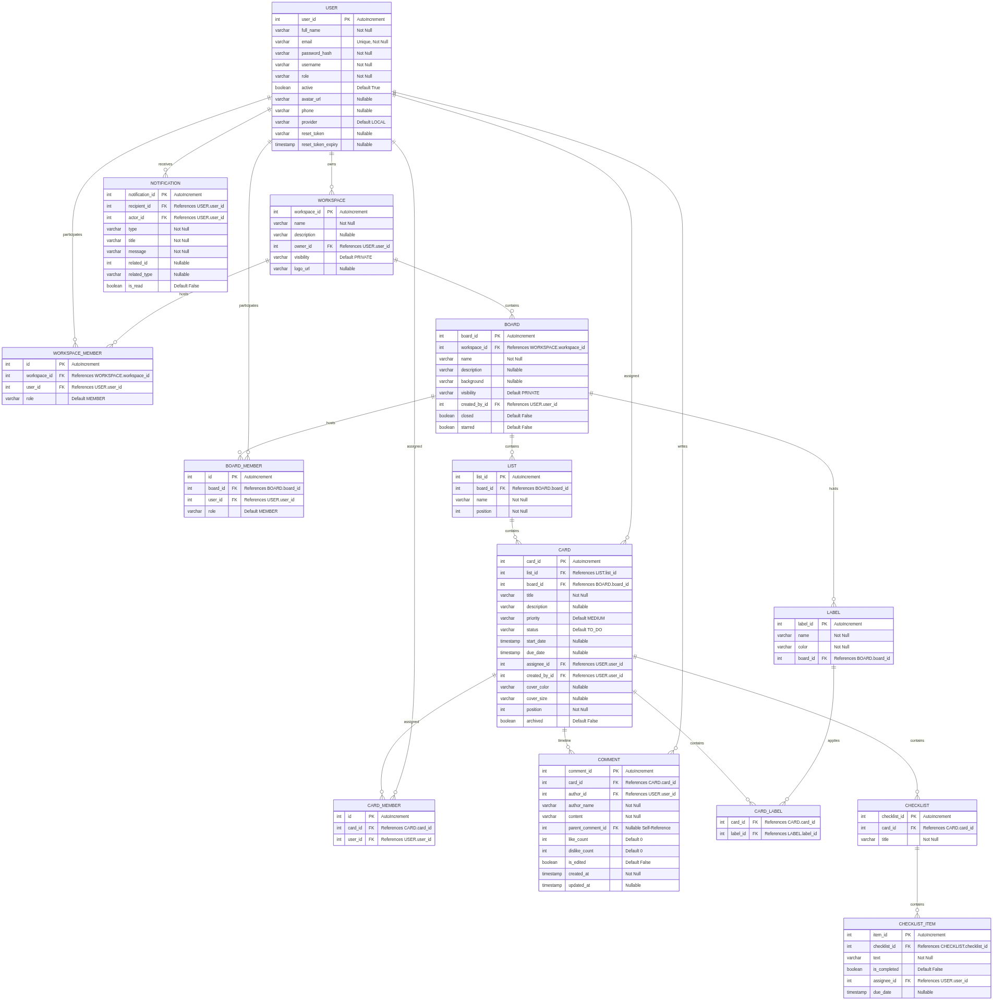
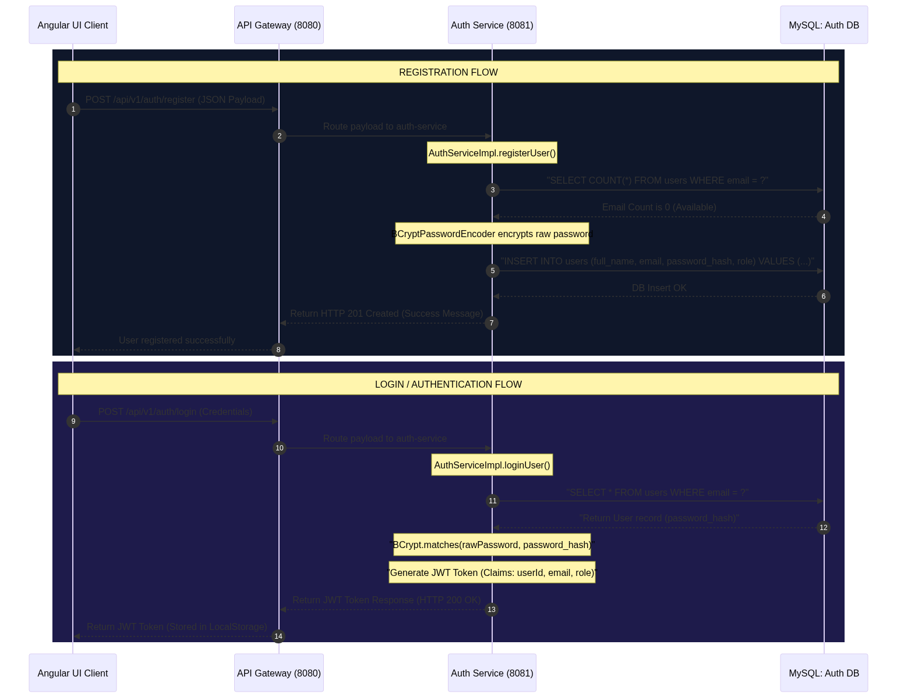

# ZASK - Distributed Task Management & Collaboration Platform

ZASK is a high-performance, real-time, and highly scalable distributed Task Management and Collaboration Platform inspired by Trello. Designed with a modern Microservices Architecture, the system is engineered to handle collaborative project boards, customizable task columns, card assignments, checklists, threaded user feedback, and real-time alerts.

---

## 🌟 Architecture & System Structure

ZASK is divided into a decoupled **Angular 17 SPA Frontend** and a **Spring Boot 3 distributed Microservices Backend**. They communicate via a unified API Gateway and utilize Service Discovery for dynamic routing and fault tolerance.

### 🌐 Complete Full-Stack System Architecture Diagram


### 🔄 End-to-End System Request-Flow Sequence Diagram


### Project Structure Overview

```text
ZASK/ (Root Workspace)
├── zask-frontend/              # Single Page Application (SPA) Client
│   ├── src/
│   │   ├── app/                # Components, services, guards, and models
│   │   ├── assets/             # Static visual assets and styling configurations
│   │   └── index.html          # Application shell
│   └── package.json
│
├── api-gateway/                # Unified edge router and CORS controller (Port 8080)
├── eureka-server/              # Netflix Eureka Service Discovery Registry (Port 8761)
│
├── auth-service/               # Identity, Authentication, and User Profiles (Port 8081)
├── workspace-service/          # Workspace management and group memberships (Port 8082)
├── board-service/              # Kanban board workspaces and themes (Port 8083)
├── list-service/               # Column workflows (To Do, In Progress, Done) (Port 8084)
├── card-service/               # Task card parameters and assignments (Port 8085)
├── comment-service/            # Nested timelines and discussion threads (Port 8086)
├── label-service/              # Visual tagging systems and checklists (Port 8087)
└── notification-service/       # Global/user-specific real-time notifications (Port 8088)
```

---

```text

D:\ZASK\ZASK-FRONTEND\SRC
│   favicon.ico
│   index.html
│   main.ts
│   styles.scss
│   
├───app
│   │   app.component.html
│   │   app.component.scss
│   │   app.component.spec.ts
│   │   app.component.ts
│   │   app.config.ts
│   │   app.routes.ts
│   │   
│   ├───core
│   │   ├───components
│   │   │   ├───confirm-dialog
│   │   │   │       confirm-dialog.component.ts
│   │   │   │       
│   │   │   └───main-layout
│   │   │           main-layout.component.ts
│   │   │           
│   │   ├───guards
│   │   │       admin.guard.ts
│   │   │       auth.guard.ts
│   │   │       guest.guard.ts
│   │   │       
│   │   ├───interceptors
│   │   │       jwt.interceptor.ts
│   │   │       
│   │   ├───models
│   │   │       activity.model.ts
│   │   │       attachment.model.ts
│   │   │       board.model.ts
│   │   │       card.model.ts
│   │   │       comment.model.ts
│   │   │       label.model.ts
│   │   │       list.model.ts
│   │   │       notification.model.ts
│   │   │       user.model.ts
│   │   │       workspace.model.ts
│   │   │       
│   │   └───services
│   │           activity.service.ts
│   │           admin.service.ts
│   │           auth.service.ts
│   │           board.service.ts
│   │           card.service.ts
│   │           comment.service.ts
│   │           export.service.ts
│   │           label.service.ts
│   │           list.service.ts
│   │           notification.service.ts
│   │           profile-preview.service.ts
│   │           workspace.service.ts
│   │           
│   ├───features
│   │   ├───admin
│   │   │   ├───admin-audit
│   │   │   │       admin-audit.component.ts
│   │   │   │       
│   │   │   ├───admin-broadcast
│   │   │   │       admin-broadcast.component.ts
│   │   │   │       
│   │   │   ├───admin-dashboard
│   │   │   │       admin-dashboard.component.ts
│   │   │   │       
│   │   │   ├───admin-layout
│   │   │   │       admin-layout.component.ts
│   │   │   │       
│   │   │   ├───admin-overdue
│   │   │   │       admin-overdue.component.ts
│   │   │   │       
│   │   │   ├───admin-users
│   │   │   │       admin-users.component.ts
│   │   │   │       
│   │   │   └───admin-workspaces
│   │   │           admin-workspaces.component.ts
│   │   │           
│   │   ├───auth
│   │   │   ├───forgot-password
│   │   │   │       forgot-password.component.html
│   │   │   │       forgot-password.component.scss
│   │   │   │       forgot-password.component.ts
│   │   │   │       
│   │   │   ├───login
│   │   │   │       login.component.html
│   │   │   │       login.component.ts
│   │   │   │       
│   │   │   ├───register
│   │   │   │       register.component.html
│   │   │   │       register.component.ts
│   │   │   │       
│   │   │   └───reset-password
│   │   │           reset-password.component.html
│   │   │           reset-password.component.ts
│   │   │           
│   │   ├───board
│   │   │   │   board.component.html
│   │   │   │   board.component.ts
│   │   │   │   
│   │   │   ├───board-members
│   │   │   │       board-members.component.html
│   │   │   │       board-members.component.ts
│   │   │   │       
│   │   │   ├───board-visibility-dialog
│   │   │   │       board-visibility-dialog.component.html
│   │   │   │       board-visibility-dialog.component.ts
│   │   │   │       
│   │   │   └───public-boards
│   │   │           public-boards.component.html
│   │   │           public-boards.component.ts
│   │   │           
│   │   ├───card
│   │   │   ├───card-detail-dialog
│   │   │   │       card-detail-dialog.component.html
│   │   │   │       card-detail-dialog.component.ts
│   │   │   │       
│   │   │   ├───card-move-copy-dialog
│   │   │   │       card-move-copy-dialog.component.ts
│   │   │   │       
│   │   │   └───card-quick-edit
│   │   │           card-quick-edit.component.html
│   │   │           card-quick-edit.component.ts
│   │   │           
│   │   ├───home
│   │   │       home.component.html
│   │   │       home.component.ts
│   │   │       
│   │   ├───join
│   │   │       join-page.component.html
│   │   │       join-page.component.ts
│   │   │       
│   │   ├───notifications
│   │   │       notifications.component.html
│   │   │       notifications.component.ts
│   │   │       
│   │   ├───profile
│   │   │   │   profile.component.html
│   │   │   │   profile.component.ts
│   │   │   │   
│   │   │   ├───archived-cards-dialog
│   │   │   │       archived-cards-dialog.component.ts
│   │   │   │       
│   │   │   └───user-profile-view
│   │   │           user-profile-view.component.ts
│   │   │           
│   │   └───workspace
│   │       │   workspace-detail.component.ts
│   │       │   
│   │       ├───board-dialog
│   │       │       board-dialog.component.ts
│   │       │       
│   │       ├───closed-boards-dialog
│   │       │       closed-boards-dialog.component.ts
│   │       │       
│   │       ├───dashboard
│   │       │       dashboard.component.ts
│   │       │       
│   │       ├───workspace-dialog
│   │       │       workspace-dialog.component.ts
│   │       │       
│   │       ├───workspace-members
│   │       │       workspace-members.component.html
│   │       │       workspace-members.component.ts
│   │       │       
│   │       ├───workspace-settings
│   │       │       workspace-settings.component.html
│   │       │       workspace-settings.component.scss
│   │       │       workspace-settings.component.ts
│   │       │       
│   │       └───workspace-settings-layout
│   │               workspace-settings-layout.component.html
│   │               workspace-settings-layout.component.scss
│   │               workspace-settings-layout.component.ts
│   │               
│   ├───layout
│   └───shared
│       ├───components
│       │   ├───add-member-dialog
│       │   │       add-member-dialog.component.html
│       │   │       add-member-dialog.component.ts
│       │   │       
│       │   └───user-profile-preview
│       │           user-profile-preview.component.ts
│       │           
│       ├───directives
│       └───pipes
├───assets
│       .gitkeep
│       
└───environments
        environment.ts

```

## 🛠️ Technology Stack

The project utilizes a curated, state-of-the-art tech stack selected for scalability, responsiveness, and clean code separation.

### Frontend Application
* **Framework:** Angular 17 (Single Page Application)
* **Styling & Presentation:** Tailwind CSS & Vanilla CSS (Harmonious visual systems, dark mode capabilities)
* **Interactions & Drag-and-Drop:** Angular CDK (Component Dev Kit) for natural Kanban card and column reordering
* **HTTP Client:** Angular RXJS (Reactive Extensions) for asynchronous, reactive API communication

### Backend Microservices
* **Core Framework:** Java 17 & Spring Boot 3.2.5
* **Routing & Edge:** Spring Cloud Gateway
* **Registry & Discovery:** Netflix Eureka
* **Security & Tokens:** Spring Security & Stateless JWT (JSON Web Tokens)
* **Data Access & Mapping:** Spring Data JPA (Object-Relational Mapping)
* **Build Tool:** Maven

### Database & Storage
* **Primary Relational Store:** MySQL Database
* **Database Access:** Custom JPA Repositories mapping directly to microservice-specific relational schemas

### 🗄️ Comprehensive Database Entity-Relationship (ER) Diagram
This detailed relational schema outlines the production-grade, decoupled database tables, data types, and primary/foreign key relationships utilized by the ZASK microservices to maintain strict data boundaries:



---

## 🧩 Microservices Directory - What They Do

The backend architecture comprises 10 independent microservices/infra nodes. Each microservice is responsible for a isolated business domain, maintaining its own database boundary.

### 🛡️ Infrastructure & Boundary Services

#### 1. API Gateway (`api-gateway` — Port 8080)
* **Purpose:** Acts as the single entry point ("front door") for the client application.
* **Role:** Intercepts incoming requests from the frontend, manages global Cross-Origin Resource Sharing (CORS) rules, and performs routing to downstream services based on URL request paths.

#### 2. Eureka Server (`eureka-server` — Port 8761)
* **Purpose:** Serves as the service registry for discovery.
* **Role:** Dynamically maintains a directory of all running microservice instances. As microservices spin up, they register their host and port with Eureka, enabling the API Gateway to route traffic to them seamlessly.

---

### 💼 Core Domain Microservices

#### 3. Auth Service (`auth-service` — Port 8081)
* **Purpose:** Identity Provider and Profile Management hub.
* **Role:** Responsible for new user registration (hashing passwords with secure algorithms), validating credentials on login, and issuing signed JSON Web Tokens (JWT). It also hosts endpoints to manage user profiles, change passwords, and deactivate accounts.

#### 4. Workspace Service (`workspace-service` — Port 8082)
* **Purpose:** Groups related project boards and handles organizational boundaries.
* **Role:** Manages Workspaces, which are top-level parent containers for teams. It handles adding new workspace entities, updating workspace settings, and inviting users to workspaces as administrators or general members.

#### 5. Board Service (`board-service` — Port 8083)
* **Purpose:** Manages Kanban boards inside workspaces.
* **Role:** Creates and manages collaborative boards. It controls board properties such as name, background style, public/private visibility status, board stars, and board-specific memberships.

#### 6. List Service (`list-service` — Port 8084)
* **Purpose:** Structures card categories within a board.
* **Role:** Manages the vertical columns (e.g., "Backlog", "To Do", "Completed") of a Kanban board. It uses precise positioning indices to maintain the horizontal sequence of columns when they are dragged and dropped.

#### 7. Card Service (`card-service` — Port 8085)
* **Purpose:** Governs individual task cards (the fundamental unit of work).
* **Role:** Handles task card lifecycle events. Features include custom titles, rich description paragraphs, priorities (Low, Medium, High), status updates, start/due dates, and user assignment arrays. It handles complex vertical and cross-list card movements when a card is dragged.

#### 8. Comment Service (`comment-service` — Port 8086)
* **Purpose:** Collaboration and active discussion forums.
* **Role:** Manages user comments posted on specific cards. It features nested replies (threaded discussions) via parent comment references, creating an interactive chronological feed of team conversations on any given task.

#### 9. Label Service (`label-service` — Port 8087)
* **Purpose:** Fine-grained categorization and task checklists.
* **Role:** Allows teams to define color-coded tags (labels) and map them to cards for rapid visual filtering. It also manages individual checklists and checklist items inside a card to track subtask completion percentages.

#### 10. Notification Service (`notification-service` — Port 8088)
* **Purpose:** Real-time feedback and system alerts.
* **Role:** The alert center of the application. It receives notification triggers (such as card assignment actions or mentions) and delivers unread counts and historical alert feeds to target user dashboards, maintaining dynamic notification badges.

---

## 🔄 Architectural Request & Authentication Flow

### 🛡️ User Registration & Login Request Flow


### Detailed Execution Lifecycle
1. **Client Action:** A user interacts with the ZASK Angular Frontend (e.g., moves a card).
2. **Unified Dispatch:** The Angular frontend attaches the user's signed JWT token to the HTTP header and forwards the request to the **API Gateway** (`http://localhost:8080/api/v1/cards/...`).
3. **Dynamic Routing:** The Gateway identifies the path, queries the **Eureka Service Discovery Server** for the active address of the Card Service, and routes the payload securely.
4. **Isolated Processing:** The **Card Service** validates the incoming token context, executes the drag-and-drop position changes, writes the changes to its **MySQL Database**, and registers a background alert with the **Notification Service** if assignees are modified.
5. **Client Refresh:** The updated card attributes are returned as JSON through the Gateway to the frontend, instantly refreshing the user interface.
